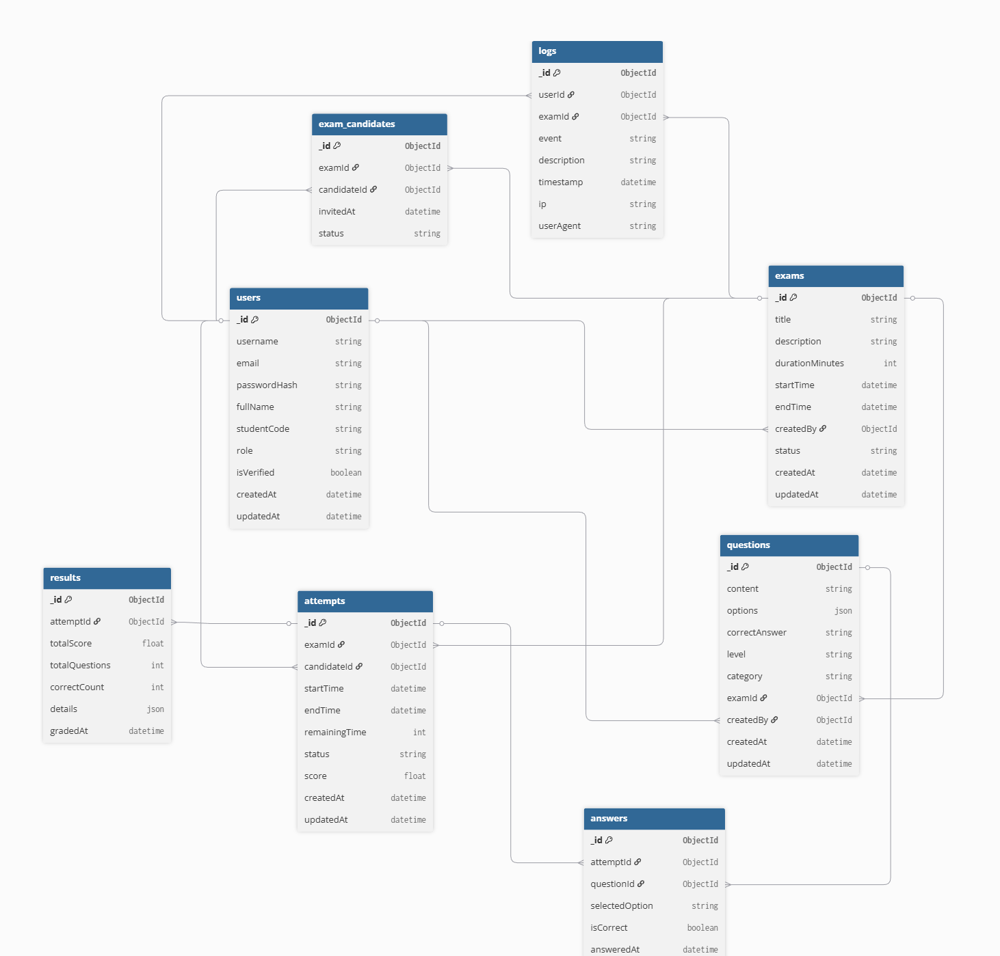

# QuizzWeb – MongoDB Schema Design

## Overview
Hệ thống quản lý thi trắc nghiệm trực tuyến **QuizzWeb** gồm các nhóm chính:
- **User Management** – quản lý người dùng, phân quyền, đăng nhập.
- **Exam Management** – quản lý kỳ thi, câu hỏi, thí sinh.
- **Attempt & Result Management** – lưu bài làm, chấm điểm tự động, lưu kết quả.
- **Logging & Monitoring** – ghi log sự kiện.

---

## Database Schema (MongoDB)

#### users
```js
{
  _id: ObjectId,
  username: String,
  email: String,
  passwordHash: String,
  fullName: String,
  studentCode: String,
  role: "admin" | "candidate",
  isVerified: Boolean,
  createdAt: Date,
  updatedAt: Date
}
```

#### exams
```js
{
  _id: ObjectId,
  title: String,
  description: String,
  durationMinutes: Number,
  startTime: Date,
  endTime: Date,
  createdBy: ObjectId, // ref → users
  status: "upcoming" | "ongoing" | "finished",
  createdAt: Date,
  updatedAt: Date
}
```

#### questions
```js
{
  _id: ObjectId,
  content: String,
  options: [
    { id: "A", text: String },
    { id: "B", text: String },
    { id: "C", text: String },
    { id: "D", text: String }
  ],
  correctAnswer: String, // "A" | "B" | ...
  level: "easy" | "medium" | "hard",
  category: String,
  examId: ObjectId, // ref → exams
  createdBy: ObjectId, // ref → users
  createdAt: Date,
  updatedAt: Date
}
```

#### exams_candidates
```js
{
  _id: ObjectId,
  examId: ObjectId,      // ref → exams
  candidateId: ObjectId, // ref → users
  invitedAt: Date,
  status: "invited" | "joined" | "submitted"
}
```

#### attempts
```js
{
  _id: ObjectId,
  examId: ObjectId,      // ref → exams
  candidateId: ObjectId, // ref → users
  startTime: Date,
  endTime: Date,
  remainingTime: Number, // seconds
  status: "in_progress" | "submitted" | "time_up",
  score: Number,
  createdAt: Date,
  updatedAt: Date
}
```

#### answers
```js
{
  _id: ObjectId,
  attemptId: ObjectId,  // ref → attempts
  questionId: ObjectId, // ref → questions
  selectedOption: String,
  isCorrect: Boolean,
  answeredAt: Date
}
```

#### results
```js
{
  _id: ObjectId,
  attemptId: ObjectId,  // ref → attempts
  totalScore: Number,
  totalQuestions: Number,
  correctCount: Number,
  details: [
    { questionId: ObjectId, selected: String, correct: String, isCorrect: Boolean }
  ],
  gradedAt: Date
}
```

#### logs
```js
{
  _id: ObjectId,
  attemptId: ObjectId,  // ref → attempts
  totalScore: Number,
  totalQuestions: Number,
  correctCount: Number,
  details: [
    { questionId: ObjectId, selected: String, correct: String, isCorrect: Boolean }
  ],
  gradedAt: Date
}
```